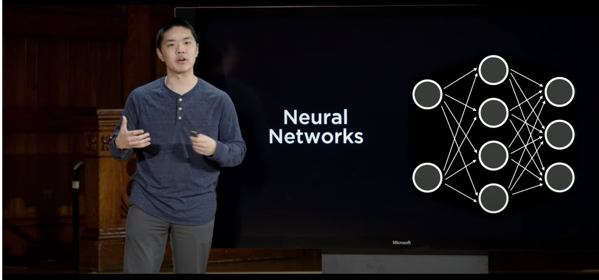

# CS50 Intro to AI with Python

This repository contains my solutions to the exercises and projects from the CS50 Intro to AI with Python course offered by Harvard University.

## Course Description

CS50 Intro to AI with Python is an online course offered by Harvard University through the edX platform. This course introduces the fundamental concepts of artificial intelligence and explores various AI techniques using the Python programming language.

## Contents

This repository is organized by weeks, with each week focusing on different topics and assignments. Here's an overview of the contents:

- Week 0: Search
- Week 1: Knowledge
- Week 2: Uncertainty
- Week 3: Optimization
- Week 4: Learning
- Week 5: Neural Networks
- Week 6: Language

Each week's directory contains exercises, projects, and supplementary materials related to the course topics.

## Course Resources

- [CS50 Intro to AI with Python](https://cs50.harvard.edu/ai/)
- [edX Platform](https://www.edx.org/course/cs50s-introduction-to-artificial-intelligence-with-python)

## Acknowledgements

Special thanks to Harvard University and the CS50 team for providing this excellent course on artificial intelligence.

## License

This repository is licensed under the [MIT License](LICENSE).

